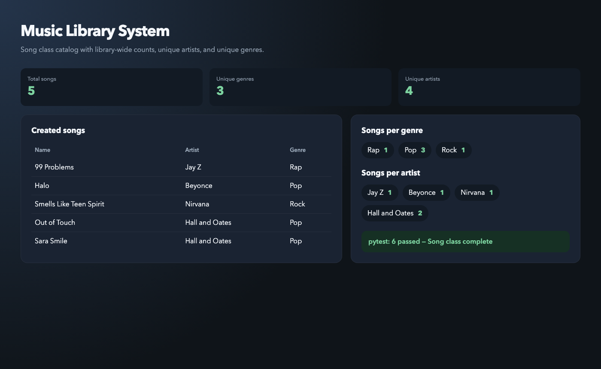

# Music Library System

A Python `Song` class for a streaming-style music library. Each song stores a name, artist, and genre. Creating a song also updates library-wide stats: total songs, unique artists and genres, and how many songs belong to each artist and genre.

This project is the completed Flatiron lab on class attributes and class methods.

## Screenshot



The screenshot shows a demo catalog built with the `Song` class: five tracks, three genres, four artists, and passing pytest results.

## Features

- Create a `Song` with `name`, `artist`, and `genre`
- Track how many songs have been created (`Song.count`)
- List unique genres and artists (`Song.genres`, `Song.artists`)
- Count songs by genre (`Song.genre_count`)
- Count songs by artist (`Song.artist_count` / `Song.artists_count`)
- Class methods run automatically when a new song is created

## Class design

| Kind | Name | Purpose |
| --- | --- | --- |
| Instance attributes | `name`, `artist`, `genre` | Describe one song |
| Class attributes | `count`, `genres`, `artists`, `genre_count`, `artist_count`, `artists_count` | Library-wide totals and unique lists |
| Class methods | `add_song_to_count`, `add_to_genres`, `add_to_artists`, `add_to_genre_count`, `add_to_artists_count` | Update those totals when a song is created |

`add_to_genres` and `add_to_artists` only append a value if it is not already in the list. `add_to_genre_count` and `add_to_artists_count` increment an existing key or start that key at `1`.

## Getting started

Requires Python 3.8 or later.

```bash
python3 -m venv .venv
source .venv/bin/activate
pip install pytest
```

## Usage

```python
from song import Song

ninety_nine_problems = Song("99 Problems", "Jay Z", "Rap")
halo = Song("Halo", "Beyonce", "Pop")
smells_like_teen_spirit = Song("Smells Like Teen Spirit", "Nirvana", "Rock")

print(ninety_nine_problems.name)   # 99 Problems
print(Song.count)                  # 3
print(Song.genres)                 # ['Rap', 'Pop', 'Rock']
print(Song.artists)                # ['Jay Z', 'Beyonce', 'Nirvana']
print(Song.genre_count)            # {'Rap': 1, 'Pop': 1, 'Rock': 1}
print(Song.artist_count)           # {'Jay Z': 1, 'Beyonce': 1, 'Nirvana': 1}
```

Creating another Pop song updates only the shared stats that should change:

```python
out_of_touch = Song("Out of Touch", "Hall and Oates", "Pop")

print(Song.count)         # 4
print(Song.genres)        # ['Rap', 'Pop', 'Rock']  — Pop is not duplicated
print(Song.genre_count)   # {'Rap': 1, 'Pop': 2, 'Rock': 1}
```

## Tests

```bash
source .venv/bin/activate
pytest lib/testing/song_test.py -v
```

Expected result: 6 passing tests covering instance attributes, total count, unique genres and artists, and per-genre / per-artist counts.

## License

This repository uses the [Learn.co Educational Content License](LICENSE.md).
